# 🎟️ Event-Driven Ticketing System (NATS + Kubernetes)

## Table of Contents

1. [Architecture Overview](#1-architecture-overview)
2. [Technical Stack](#2-technical-stack)
3. [Core Workflows](#3-core-workflows)
4. [Folder Structure Of Shared Library](#4-shared-library)
5. [Authentication Via Magic Links](#5-authentication-via-magic-links)
6. [Event Specifications](#6-event-specifications)
7. [Key Architecture Features](#7-key-architecture-features)
8. [Service Responsibilities](#8-service-responsibilities)
9. [CI Pipeline](#9-ci-pipeline)

<a id="1-architecture-overview"></a>

## 🌐 Architecture Overview

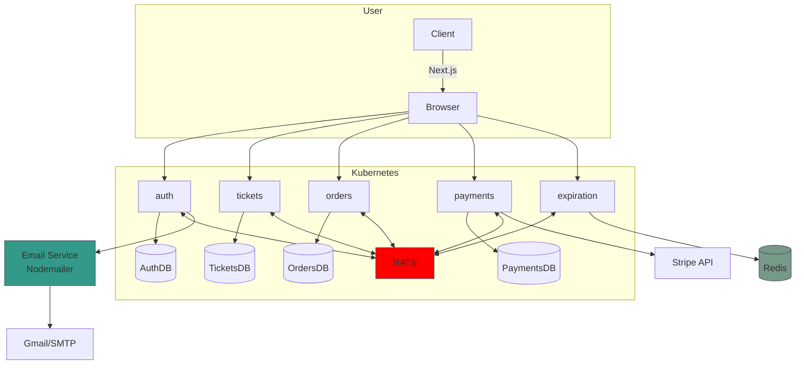

<a id="2-technical-stack"></a>

## 🛠️ Technical Stack

| Component          | Technology            | Purpose                          |
| ------------------ | --------------------- | -------------------------------- |
| **Backend**        | Node.js + TypeScript  | Service implementation           |
| **Event Bus**      | NATS Streaming        | Service-to-service communication |
| **Database**       | MongoDB               | Persistent data storage          |
| **Frontend**       | Next.js               | User interface                   |
| **Authentication** | JWT + Magic Links     | Passwordless authentication      |
| **Email Service**  | Nodemailer + Gmail    | Magic link delivery              |
| **Orchestration**  | Kubernetes + Skaffold | Container management             |
| **Shared Lib**     | `@aaticketsaa/common` | Reusable components              |

<a id="3-core-workflows"></a>

## 🔄 Core Event Flow

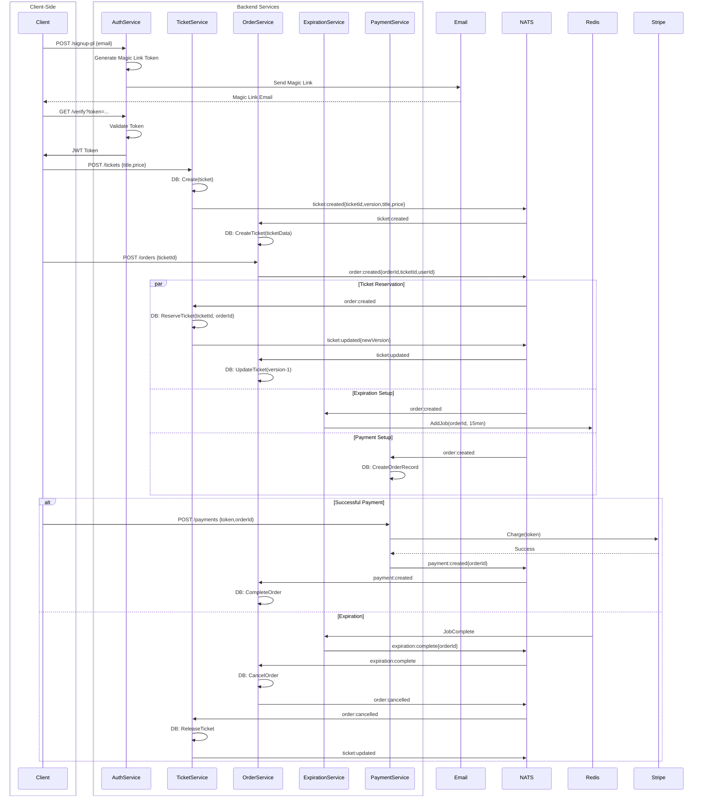

<a id="4-shared-library"></a>

## 🔄 Shared Library (@aaticketsaa/common) Folder Structure

Shared library for Ticketing Microservices System containing events, errors, and middlewares.

```
├── build/ # Compiled output
├── src/
│ ├── errors/ # Custom error classes
│ │ ├── bad-request-error.ts
│ │ ├── custom-error.ts
│ │ ├── database-connection-error.ts
│ │ ├── not-authorized-error.ts
│ │ ├── not-found-error.ts
│ │ ├── request-validation-error.ts
│ │ ├── internal-server-error.ts
│ │ └── duplicate-resource-creation.ts
| |
│ ├── events/ # NATS event system
│ │ ├── types/
│ │ │ └── order-status.ts
│ │ │
│ │ ├── base-listener.ts
│ │ ├── base-publisher.ts
│ │ ├── expiration-complete-event.ts
│ │ ├── order-cancelled-event.ts
│ │ ├── order-created-event.ts
│ │ ├── payment-created-event.ts
│ │ ├── subjects.ts
│ │ ├── ticket-created-event.ts
│ │ └── ticket-updated-event.ts
│ │
│ ├── middlewares/ # Express middlewares
│ │ ├── current-user.ts
│ │ ├── error-handler.ts
│ │ ├── require-auth.ts
│ │ ├── validate-request.ts
│ │ └── index.ts
│ │
│ └── index.ts # Main exports
└── .gitignore
```

<a id="5-authentication-via-magic-links"></a>

## 🔐 Authentication via Magic Links

```mermaid
sequenceDiagram
    participant C as Client
    participant A as Auth Service
    participant E as Email Service
    participant DB as Database

    C->>A: POST /signup-pl {email}
    A->>DB: Check if user exists
    DB-->>A: User data

    alt New User
        A->>DB: Create user with magic token
    else Existing User
        A->>DB: Update magic token
    end

    A->>A: Generate secure token (32 chars)
    A->>A: Set expiration (1 min)
    A->>E: Send magic link email
    E->>C: Email with magic link

    C->>A: GET /verify-magic-links?token=...
    A->>DB: Validate token & expiration
    DB-->>A: Valid user data

    A->>A: Generate JWT
    A->>C: Set cookie & redirect
    A->>DB: Invalidate magic token
```

<a id="6-event-specifications"></a>

## 📜 Event Specifications

| Event Type            | Publisher         | Consumers                                        | Data Structure                        |
| --------------------- | ----------------- | ------------------------------------------------ | ------------------------------------- |
| `ticket:created`      | TicketService     | OrderService                                     | `{id, title, price, version, userId}` |
| `ticket:updated`      | TicketService     | OrderService                                     | `{id, orderId?, version, status}`     |
| `order:created`       | OrderService      | TicketService, PaymentService, ExpirationService | `{id, ticketId, userId, status}`      |
| `order:cancelled`     | OrderService      | TicketService, PaymentService                    | `{id, version, reason}`               |
| `payment:created`     | PaymentService    | OrderService                                     | `{orderId, chargeId}`                 |
| `expiration:complete` | ExpirationService | OrderService                                     | `{orderId}`                           |

<a id="7-key-architecture-features"></a>

## 🧩 Key Architecture Features

1. Optimistic Concurrency Control

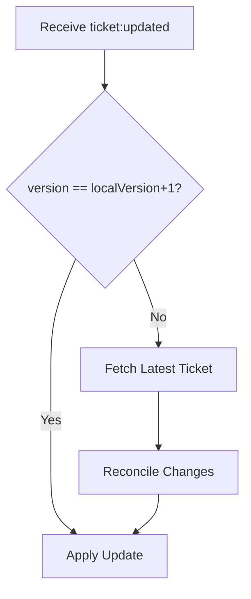

2. Event Processing Flow

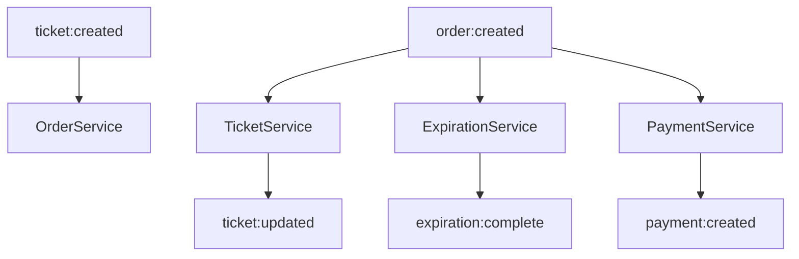

3. Expiration Handling

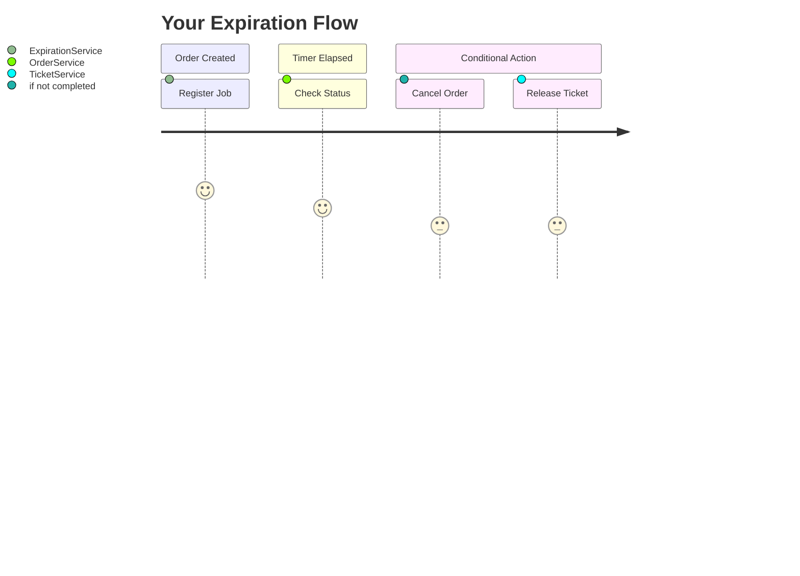

<a id="8-service-responsibilities"></a>

### 🏗 Service Responsibilities

1. Ticket Service

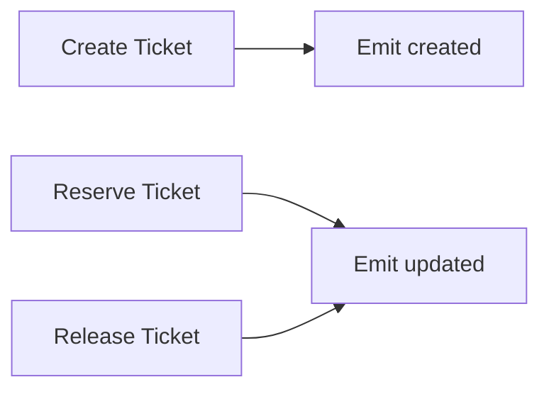

2. Order Service

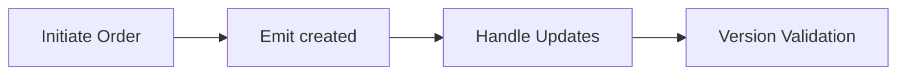

3. Payment Service

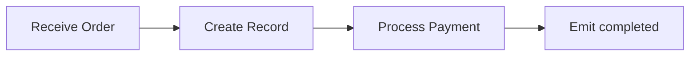

4. Payment Service

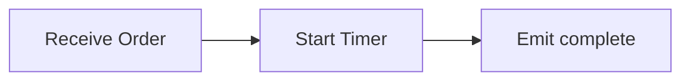

<a id="9-ci-pipeline"></a>

## 🧪 CI Pipeline Flow

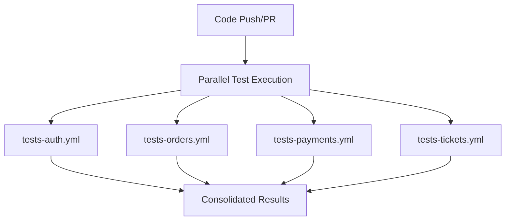
