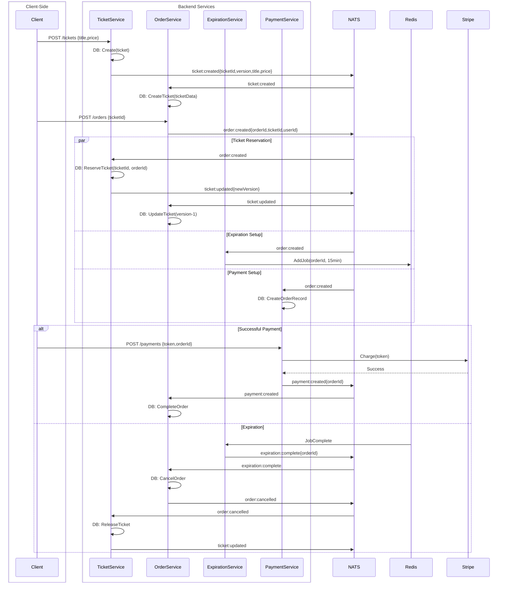

# 🎟️ Event-Driven Ticketing System (NATS + Kubernetes)

## Table of Contents

1. [Architecture Overview](#1-architecture-overview)
2. [Technical Stack](#2-technical-stack)
3. [Core Workflows](#3-core-workflows)
4. [Folder Structure Of Shared Library](#4-shared-library)
5. [Event Specifications](#5-event-specifications)
6. [Key Architecture Features](#6-key-architecture-features)
7. [Service Responsibilities](#7-service-responsibilities)
8. [CI Pipeline](#8-ci-pipeline)

<a id="1-architecture-overview"></a>

## 🌐 Architecture Overview

```mermaid
graph TD
    subgraph User
        A[Client] -->|Next.js| B[Browser]
    end

    subgraph Kubernetes
        B --> C[auth]
        B --> D[tickets]
        B --> E[orders]
        B --> F[payments]
        B --> L[expiration]

        C --> G[(AuthDB)]
        D --> H[(TicketsDB)]
        E --> I[(OrdersDB)]
        F --> J[(PaymentsDB)]

        C <--> K[NATS]
        D <--> K
        E <--> K
        F <--> K
        L <--> K
    end

    F --> M[Stripe API]
    L --> N[(Redis)]

    style K fill:#2d3748,stroke:#4a5568
    style N fill:#742a2a,stroke:#4a5568
```



<a id="2-technical-stack"></a>

## 🛠️ Technical Stack

| Component         | Technology            | Purpose                          |
| ----------------- | --------------------- | -------------------------------- |
| **Backend**       | Node.js + TypeScript  | Service implementation           |
| **Event Bus**     | NATS Streaming        | Service-to-service communication |
| **Database**      | MongoDB               | Persistent data storage          |
| **Frontend**      | Next.js               | User interface                   |
| **Orchestration** | Kubernetes + Skaffold | Container management             |
| **Shared Lib**    | `@aaticketsaa/common` | Reusable components              |

<a id="3-core-workflows"></a>
🔄 Core Event Flow



<a id="4-shared-library"></a>

## 🔄 Shared Library (@aaticketsaa/common) Folder Structure

Shared library for Ticketing Microservices System containing events, errors, and middlewares.

```
├── build/ # Compiled output
├── src/
│ ├── errors/ # Custom error classes
│ │ ├── bad-request-error.ts
│ │ ├── custom-error.ts
│ │ ├── database-connection-error.ts
│ │ ├── not-authorized-error.ts
│ │ ├── not-found-error.ts
│ │ └── request-validation-error.ts
│ │
│ ├── events/ # NATS event system
│ │ ├── types/
│ │ │ └── order-status.ts
│ │ │
│ │ ├── base-listener.ts
│ │ ├── base-publisher.ts
│ │ ├── expiration-complete-event.ts
│ │ ├── order-cancelled-event.ts
│ │ ├── order-created-event.ts
│ │ ├── payment-created-event.ts
│ │ ├── subjects.ts
│ │ ├── ticket-created-event.ts
│ │ └── ticket-updated-event.ts
│ │
│ ├── middlewares/ # Express middlewares
│ │ ├── current-user.ts
│ │ ├── error-handler.ts
│ │ ├── require-auth.ts
│ │ ├── validate-request.ts
│ │ └── index.ts
│ │
│ └── index.ts # Main exports
└── .gitignore
```

<a id="5-event-specifications"></a>

## 📜 Event Specifications

| Event Type            | Publisher         | Consumers                                        | Data Structure                        |
| --------------------- | ----------------- | ------------------------------------------------ | ------------------------------------- |
| `ticket:created`      | TicketService     | OrderService                                     | `{id, title, price, version, userId}` |
| `ticket:updated`      | TicketService     | OrderService                                     | `{id, orderId?, version, status}`     |
| `order:created`       | OrderService      | TicketService, PaymentService, ExpirationService | `{id, ticketId, userId, status}`      |
| `order:cancelled`     | OrderService      | TicketService, PaymentService                    | `{id, version, reason}`               |
| `payment:created`     | PaymentService    | OrderService                                     | `{orderId, chargeId}`                 |
| `expiration:complete` | ExpirationService | OrderService                                     | `{orderId}`                           |

<a id="6-key-architecture-features"></a>

## 🧩 Key Architecture Features

1. Optimistic Concurrency Control


2. Event Processing Flow


3. Expiration Handling


<a id="7-service-responsibilities"></a>

### 🏗 Service Responsibilities

1. Ticket Service


2. Order Service


3. Payment Service


4. Payment Service


<a id="8-ci-pipeline"></a>

## 🧪 CI Pipeline Flow


